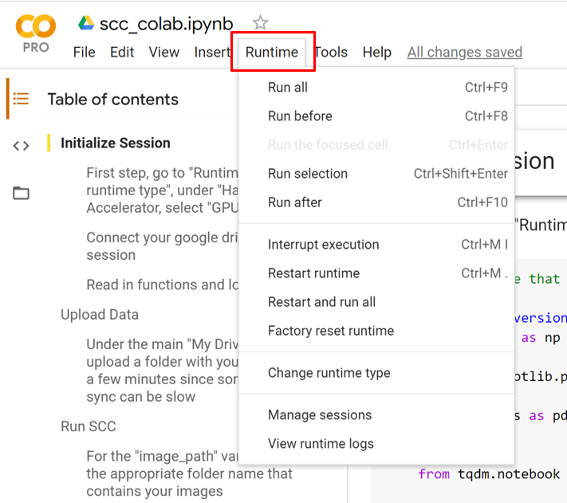
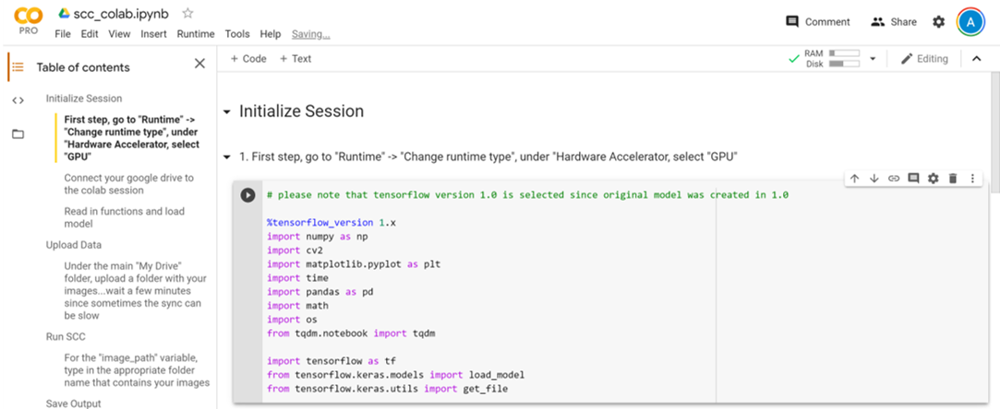
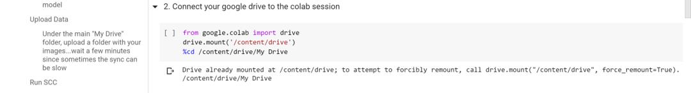
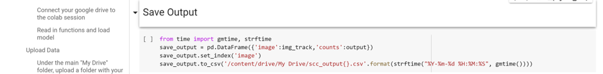

# To use SCC on Colab, go to the following link:
https://colab.research.google.com/drive/1ZC5GXTEnJ5V3ZIPfcw_uvb9S4eJgbule?usp=sharing

# (1) Create Gmail if you do not have one
#### Ensure a basic familiarity with Google Drive
 

# (2) Open Files

#### Open `scc_colab` and select the banner at the top of screen `Open in Colab`
 

# (3) Set Up Colab
#### First begin by selecting `Runtime` then `Change runtime type`, then under `Hardware accelerator` select `GPU`

 

# (4) Begin Running Code
 

## (a) Initialize Session

#### This section imports all the relevant packages
#### Note: Tensorflow 1x is used here for accurate inference since the original CNN model was trained on Tf 1.0

 
 

## (b) Connect Drive to Colab Session
#### This section makes your google drive accessible to Colab...once this code is run, a link will appear: 
#### - click this link and follow the prompts until you receieve an authorization code. 
#### - paste the authorization code into the Colab notebook prompt and hit `Enter`

 
 

## (c) Clone SCC into Drive
#### Run this block to copy the SimpylCellCounter repository into the `My Drive` folder in your drive

 
 

## (d) Upload Images into Drive
#### - navigate to `My Drive` in your Google Drive
#### - select `New` -> `Folder Upload` and upload your image data
 

## (e) Run Main SCC Script
#### This code block executes `scc`

 
 

## (f) Save Output
#### This code block will save the output of SCC under `My Drive` in your drive with the title `scc_output` followed by the date and time

