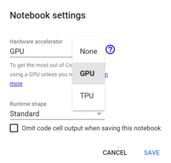

# (1) Create Gmail if you do not have one
#### Ensure a basic familiarity with Google Drive

# (2) Open Files

#### Open `scc_colab` and select the banner at the top of screen `Open in Colab`

# (3) Set Up Colab
#### First begin by selecting `Runtime` then `Change runtime type`, then under `Hardware accelerator` select `GPU`

#

# (4) Begin Running Code

## (a) Initialize Session
#
